<div align='center'><font size='70'>信息收集-旅行记</font></div>
"只有不努力的黑客，没有攻不破的系统"。在SRC漏洞挖掘或渗透测试中，信息收集占很大一部分，能收集到别人收集不到的资产，就能挖到别人挖不到的洞。

[TOC]

# 收集域名信息

知道目标域名之后，我们要做的第一件事情就是获取域名的注册信息，包括该域名的DNS服务器信息和注册人的联系信息等。

## Whois 查询

Whois 简单来说，就是一个用来查询域名是否已经被注册，以及注册域名的详细信息的数据库（如域名所有人、域名注册商、域名注册日期和过期日期、DNS等）。通过域名Whois服务器查询，可以查询域名归属者联系方式，以及注册和到期时间。

```
Kali下whois查询 https://www.kali.org/downloads/

域名Whois查询 - 站长之家 http://whois.chinaz.com/

Whois 爱站 http://whois.aizhan.com/

ip138 https://site.ip138.com/

Whois Lookup https://www.whois.net/

ICANN Lookup https://lookup.icann.org/

域名信息查询 - 腾讯云https://whois.cloud.tencent.com/domain?domain=

nicolasbouliane http://nicolasbouliane.com/utils/whois/?url=http://baidu.com

新网 whois信息查询 http://whois.xinnet.com/

IP WHOIS查询 - 站长工具 http://tool.chinaz.com/ipwhois/
```

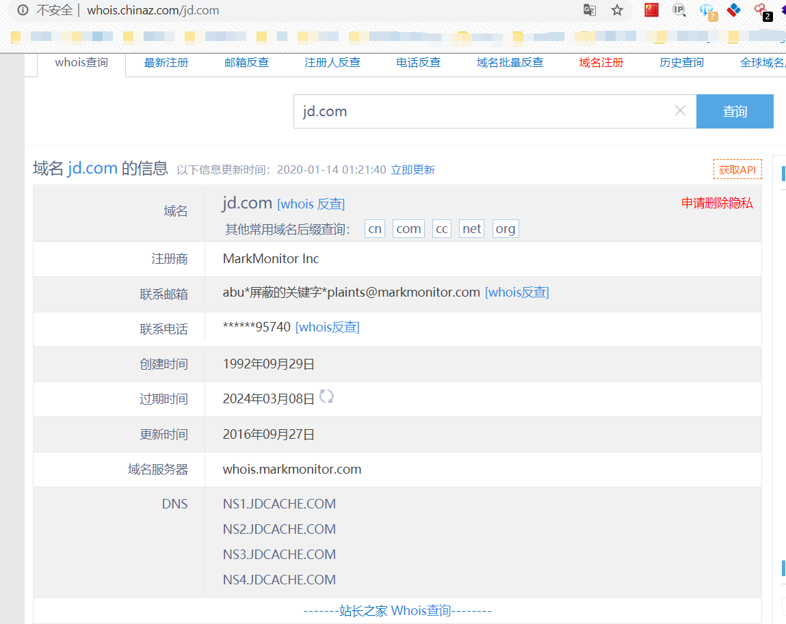

## 备案信息查询

国内网站注册需要向国家有关部门申请备案，防止网站从事非法活动，而国外网站不需要备案2333。

```
ICP备案查询网 http://www.beianbeian.com/

ICP备案查询 - 站长工具 http://icp.chinaz.com/

SEO综合查询 - 爱站 https://www.aizhan.com/seo/

批量查询 - 站长工具 http://icp.chinaz.com/searchs

工业和信息化部ICP/IP/域名信息备案管理 http://www.beian.miit.gov.cn/publish/query/indexFirst.action
```

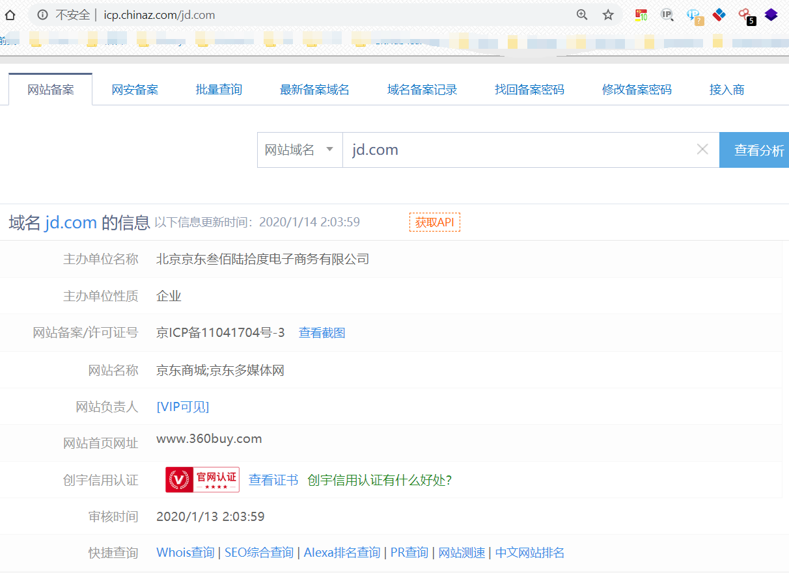

## 信用信息查询

国家企业信用信息公示系统 http://www.gsxt.gov.cn/index.html

全国企业信息查询 http://company.xizhi.com/

个人信用查询搜索-企业信息查询搜索-统一社会信用代码查询-信用中国 https://www.creditchina.gov.cn/


## IP反查站点的站

### 在线网站

#### Dnslytics

Dnslytics地址：https://dnslytics.com/

利用Dnslytics反查IP可以得到如下信息

```
IP information
Network information
Hosting information
SPAM database lookup
Open TCP/UDP ports
Blocklist lookup
Whois information
Geo information
Country information
Update information
```

利用Dnslytics反查域名可以得到如下信息

```
Domain and Ranking Information
Hosting Information{
	A / AAAA Record
	NS Record
	MX Record
	SPF Record
}
Web Information
Whois Information
```

## 浏览器插件

通过Google、FireFox等插件的使用，收集域名信息

### myip.ms


### TCPIPUTILS


### DNSlytics

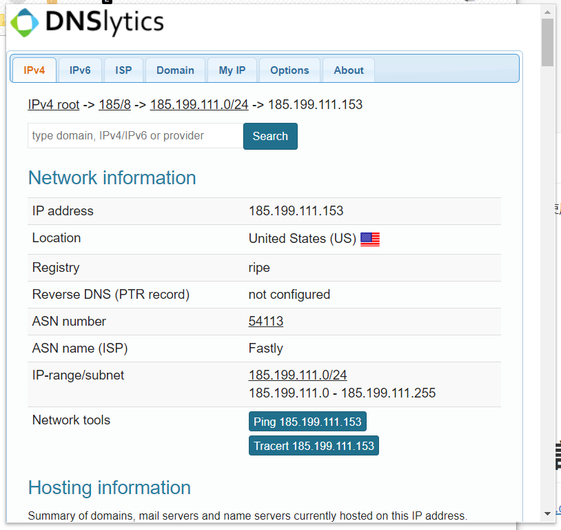

#### 

# 收集相关应用信息

天眼查 https://www.tianyancha.com/

企查查 https://www.qichacha.com/

## 微信公众号&微博

### 天眼查

根据前面获取的企业名称可以获取目标企业的微信公众号、微博、备案站点、软件著作权等信息。

天眼查-商业安全工具 https://www.tianyancha.com/


微信公众号


微博


## APP

### 七麦数据

https://www.qimai.cn/

通过当前APP查询同开发商应用，得到目标所有APP应用


### AppStore

https://apps.apple.com/

通过当前APP查询同开发商应用，得到目标所有APP应用


# 收集子域名信息

子域名也就是二级域名，是指顶级域名下的域名。假设我们的目标网络规模比较大，直接从主域入手显然是很不理智的，因为对于这种规模的目标，一般其主域都是重点防护区域，所以不如先进入目标的某个子域，然后再想办法迂回接近真正的目标，这无疑是个比较好的选择。那么问题来了，怎样才能尽可能多地搜集目标的高价值子域呢？常用的方法有以下这几种。

## 在线平台

### 第三方平台查询

主要是一些第三方网站和一些博主提供的服务

```
ip138 https://site.ip138.com/

站长工具 http://tool.chinaz.com/subdomain/?domain=

hackertarget https://hackertarget.com/find-dns-host-records/

phpinfo https://phpinfo.me/domain/

t1h2ua https://www.t1h2ua.cn/tools/

dnsdumpster https://dnsdumpster.com/

chinacycc https://d.chinacycc.com/

zcjun http://z.zcjun.com/
```

### 权重综合查询

爱站 https://www.aizhan.com/seo/

站长工具 http://rank.chinaz.com/all/


### 全国政府网站基本数据库

http://114.55.181.28/databaseInfo/index


### IP反查绑定域名网站

IP关联域名，大部分网站一个IP多个域名

```
http://s.tool.chinaz.com/same?s

http://dns.aizhan.com/
```

## 资产搜索引擎

google、shodan、FOFA、zoomeye

### Google语法查询

搜索子域名 "site:xxxxx"

```
site:baidu.com
```

z

### FOFA语法查询

https://fofa.so/

搜索子域名 "domain:xxxxx"

```
domain="baidu.com"
```


## 工具枚举

常用子域名工具如下（Github上都可搜到）

```
OneForAll
Layer
Sublist3r
subDomainsBrute
K8
wydomain
dnsmaper
dnsbrute
Findomain
fierce等

```

个人推荐：`OneForAll`、`Layer`、`Sublist3r`、`subDomainsBrute`

### OneForAll

OneForAll是一款功能强大的子域收集工具，拥有多个模块和接口扫描，收集子域信息很全，包括子域、子域IP、子域常用端口、子域Title、子域Banner、子域状态等。

项目地址：`https://github.com/shmilylty/OneForAll`

子域名收集：`python3 oneforall.py --target=target.com run`

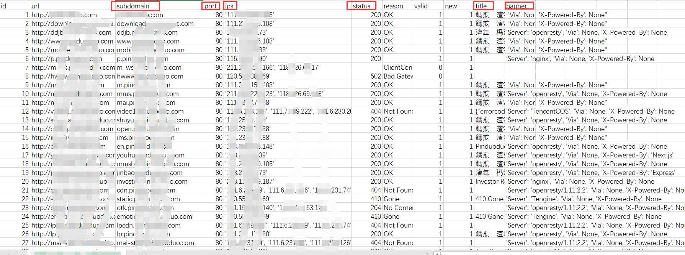

### Layer

Layer子域名挖掘机的使用方法比较简单，在域名对话框中直接输入域名就可以进行扫描，它的显示界面比较细致，有域名、解析IP、开放端口、Web服务器和网站状态等


### subDomainsBrute

subDomainsBrute的特点是可以用小字典递归地发现三级域名、四级域名,甚至五级域名等不容易被探测到的域名。

项目地址：`https://github.com/lijiejie/subDomainsBrute`

子域名收集：`python subDomainsbrute.py xtarget.com`

### Sublist3r

Sublist3r也是一个比较常用的工具， 它能列举多种资源，如在Google、Yahoo、 Bing、 Baidu和Ask等搜索引擎中可查到的子域名，还可以列出Netcraft、VirusTotal、ThreatCrowd、 DNSdumpster、SSL Certificates、和Reverse DNS查到的子域名。

项目地址：`https://github.com/aboul3la/Sublist3r`

子域名收集：`python sublist3r.py -d target.com -b -t 50 -p 80,443,21,22`


## 证书透明度公开日志枚举


证书透明度(Certificate Transparency, CT)是证书授权机构(CA) 的一个项目，证书授权机构会将每个SSL/TLS证书发布到公共日志中。一个SSL/TLS证书通常包含域名、子域名和邮件地址， 这些也经常成为攻击者非常希望获得的有用信息。查找某个域名所属证书的最简单的方法就是使用搜索引|擎搜索一些公开的CT日志。

### 在线第三方平台查询

```
crt.sh: https://crt.sh
censys: https://censys.io
myssl：https://myssl.com

```

```
crt:
https://crt.sh/?q=baidu.com

```


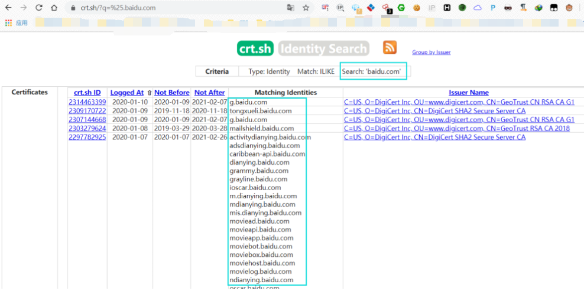

```
censys:
https://www.censys.io/certificates?q=baidu.com

```


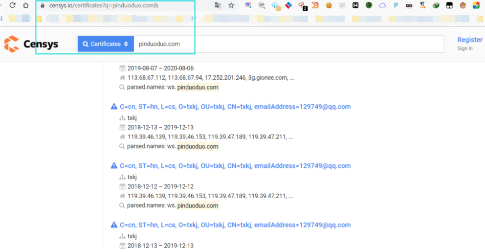

### 工具枚举查询

通过工具可以调用各个证书接口进行域名查询 

常用工具

```
Findomain
Sublist3r（SSL Certificates）等

```

#### Findomain

Findomain不使用子域名寻找的常规方法，而是使用证书透明度日志来查找子域，并且该方法使其工具更加快速和可靠。该工具使用多个公共API来执行搜索：

```
Certspotter
Crt.sh
Virustotal
Sublist3r
Facebook **
Spyse (CertDB) *
Bufferover
Threadcrow
Virustotal with apikey **

```

项目地址：`https://github.com/Edu4rdSHL/findomain`

子域名收集：`findomain -t target.com `

使用所有API搜索子域并将数据导出到CSV文件：`findomain -t target.com -a -o csv`

## DNS历史解析

dnsdb https://www.dnsdb.io

viewdns https://viewdns.info/

## DNS域传送漏洞

目前来看"DNS域传送漏洞"已经很少了。

### DNS记录分类

常见的DNS记录有以下几类：

```
A记录       IP地址记录,记录一个域名对应的IP地址
AAAA记录    IPv6地址记录，记录一个域名对应的IPv6地址
CNAME记录   别名记录，记录一个主机的别名
MX记录      电子邮件交换记录，记录一个邮件域名对应的IP地址
NS记录      域名服务器记录 ,记录该域名由哪台域名服务器解析
PTR记录     反向记录，也即从IP地址到域名的一条记录
TXT记录     记录域名的相关文本信息

```

### DNS注册信息

Whois查询

### DNS域传送漏洞原理

DNS服务器分为：`主服务器`、`备份服务器`和`缓存服务器`。在主备服务器之间同步数据库，需要使用`“DNS域传送”`。域传送是指备份服务器从主服务器拷贝数据，并用得到的数据更新自身数据库。

若DNS服务器配置不当，可能导致攻击者获取某个域的所有记录。造成整个网络的拓扑结构泄露给潜在的攻击者，包括一些安全性较低的内部主机，如测试服务器。同时，黑客可以快速的判定出某个特定zone的所有主机，收集域信息，选择攻击目标，找出未使用的IP地址，绕过基于网络的访问控制。

### DNS域传送漏洞检测

#### nslookup

基本过程

```
1) nslookup             #进入交互式shell
2) server dns.xx.yy.zz  #设定查询将要使用的DNS服务器
3) ls xx.yy.zz          #列出某个域中的所有域名
4) exit                 #退出

```

漏洞检验-不存在漏洞

```
> nslookup
Server:  lkwifi.cn
Address:  192.168.68.1

*** lkwifi.cn can't find nslookup: Non-existent domain
> server ss2.bjfu.edu.cn
Default Server:  ss2.bjfu.edu.cn
Address:  202.204.112.67

> ls bjfu.edu.cn
[ss2.bjfu.edu.cn]
*** Can't list domain bjfu.edu.cn: Query refused
The DNS server refused to transfer the zone bjfu.edu.cn to your computer. If this
is incorrect, check the zone transfer security settings for bjfu.edu.cn on the DNS
server at IP address 202.204.112.67.

> exit

```

漏洞检验-存在漏洞

```
> nslookup
> server dns1.xxx.edu.cn
> ls xxx.edu.cn

```


#### nmap

利用nmap漏洞检测脚本"dns-zone-transfer"进行检测

```
nmap --script dns-zone-transfer --script-args dns-zone-transfer.domain=xxx.edu.cn -p 53 -Pn dns.xxx.edu.cn

```

```
--script dns-zone-transfer 表示加载nmap漏洞检测脚本dns-zone-transfer.nse，扩展名.nse可省略

--script-args dns-zone-transfer.domain=xxx.edu.cn 向脚本传递参数，设置列出某个域中的所有域名

-p 53 设置扫描53端口

-Pn 设置通过Ping发现主机是否存活

```

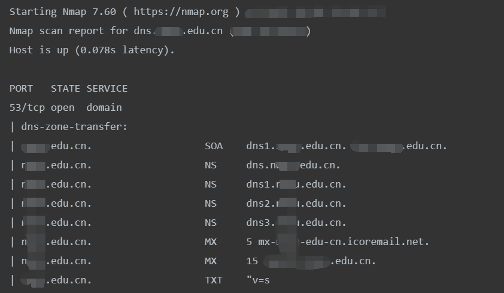

#### dig

使用说明 `dig -h`

漏洞测试

```
dig @dns.xxx.edu.cn axfr xxx.edu.cn

```

`axfr` 是q-type类型的一种: axfr类型是Authoritative Transfer的缩写，指请求传送某个区域的全部记录。


# 查找真实IP

如果挖掘的目标购买了CDN服务，可以直接ping目标的域名，但得到的并非真正的目标Web服务器，只是离我们最近的一台目标节点的CDN服务器，这就导致了我们没法直接得到目标的真实IP段范围。

## CDN简介

CDN的全称是Content Delivery Network，即内容分发网络。其基本思路是尽可能避开互联网上有可能影响数据传输速度和稳定性的瓶颈和环节，使内容传输的更快、更稳定。通过在网络各处放置节点服务器所构成的在现有的互联网基础之上的一层智能虚拟网络，CDN系统能够实时地根据网络流量和各节点的连接、负载状况以及到用户的距离和响应时间等综合信息将用户的请求重新导向离用户最近的服务节点上。

## 国内外CND

国内常见CDN

```
阿里云
腾讯云
百度云
网宿科技(ChinanNet Center)
蓝汛
金山云
UCloud
网易云
世纪互联
七牛云
京东云等

```

国外常见CDN

```
Akamai(阿卡迈)
Limelight Networks(简称LLNW)
AWS Cloud(亚马逊)
Google(谷歌)
Comcast(康卡斯特)

```

## 判断目标是否存在CDN

由于CDN需要代价，一般小企业很大几率不会存在CDN服务。

假如一些企业存在CDN服务，那该如何寻找其真实IP呢，往下看，常见几种手法

### Ping目标主域

通常通过ping目标主域，观察域名的解析情况，以此来判断其是否使用了CDN

对京东和阿里还有一家电器企业进行ping测试，观察域名的解析情况，可以看到京东和阿里都采用了自家CDN，而那个电器企业没有CDN服务

```
C:\Users\Qftm>ping www.jd.com

C:\Users\Qftm>ping www.alibaba.com

C:\Users\Qftm>ping www.dfle.com.cn

```


### Nslookup

#### 不同DNS域名解析

不同DNS域名解析情况对比，判断其是否使用了CDN

不同DNS解析结果若不一样，很有可能存在CDN服务

```
C:\Users\Qftm>nslookup www.dfle.com.cn 8.8.8.8

C:\Users\Qftm>nslookup www.dfle.com.cn 114.114.114.114

```

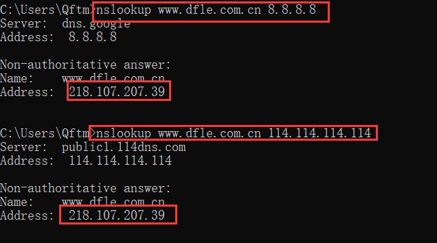

```
λ  Qftm >>>: nslookup www.baidu.com 8.8.8.8

λ  Qftm >>>: nslookup www.baidu.com 114.114.114.114

```


#### nslookup默认解析

若解析结果有多个，很有可能存在CDN，相反，若解析结果有一个，可能不存在CDN(不能肯定)


### 全国Ping

利用全国多地区的ping服务器操作，然后对比每个地区ping出的IP结果，查看这些IP是否一致， 如果都是一样的，极有可能不存在CDN。如果IP大多不太一样或者规律性很强，可以尝试查询这些IP的归属地，判断是否存在CDN。

在线网址

```
Ping检测-站长工具 http://ping.chinaz.com/

17CE https://www.17ce.com/

ipip https://tools.ipip.net/newping.php (支持国内、国外)

```

#### 站长工具

测试目标：`www.jd.com`


#### 17CE

测试目标：`www.baidu.com`

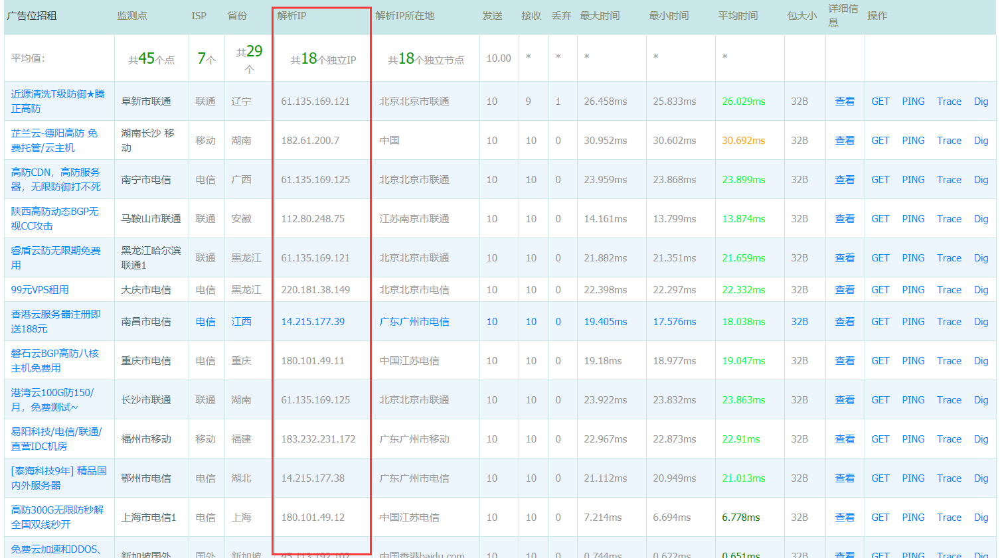

#### IPIP


### 工具查询

这里工具只能作为辅助，有一定误报的概率，只能作为参考

#### Cdnplanet

cdnplanet https://www.cdnplanet.com/tools/cdnfinder/ （查询可能比较慢）


## 绕过CDN查找真实IP

在确认了目标确实用了CDN以后，就需要绕过CDN寻找目标的真实IP，下面介绍一些常规的方法。

### 内部邮箱源

一般的邮件系统都在内部，没有经过CDN的解析，通过利用目标网站的邮箱注册、找回密码或者RSS订阅等功能，查看邮件、寻找邮件头中的邮件服务器域名IP，ping这个邮件服务器的域名,就可以获得目标的真实IP。

注意：必须是目标自己的邮件服务器，第三方或公共邮件服务器是没有用的。


### 国外请求

很多时候国内的CDN对国外得覆盖面并不是很广，故此可以利用此特点进行探测。通过国外代理访问就能查看真实IP了，或者通过国外的DNS解析，可能就能得到真实的IP。

#### 国际Ping

国际ping测试站点

```
ipip https://tools.ipip.net/newping.php

ASM https://asm.ca.com/en/ping.php

```

测试站点：`www.yeah.net`


#### 国外DNS解析

世界各地DNS服务器地址大全：`http://www.ab173.com/dns/dns_world.php`

测试站点：`www.yeah.net`

美国加利福尼亚州山景市谷歌公司DNS服务器： `8.8.4.4`


### 分站域名&C段查询

很多网站主站的访问量会比较大，所以主站都是挂CDN的，但是分站可能没有挂CDN,可以通过ping二级域名获取分站IP， 可能会出现分站和主站不是同一个IP但在同一个C段下面的情况，从而能判断出目标的真实IP段。

#### 分站域名

具体见上面**<收集子域名信息>**部分


#### C段查询

* 在线查询

```
https://phpinfo.me/bing.php

```


* 工具

`K8_C段旁注工具6.0`、`nmap`、`IISPutScanner`、`小米范WEB查找器` 等

`小米范WEB查找器`：http://pan.baidu.com/s/1pLjaQKF


* 网络资产搜索引擎

Fofa、Shodan、ZoomEye

利用这些网络空间资产搜索引擎来搜索暴露在外的端口信息

利用语法搜索C段信息


### 网站漏洞

通过网站的信息泄露如phpinfo泄露，github信息泄露，命令执行等漏洞获取真实ip。

#### 一些测试文件

phpinfo、test等


#### SSRF漏洞

服务器主动向外发起连接，找到真实IP地址

### 查询域名解析记录

一般网站从部署开始到使用cdn都有一个过程，周期如果较长的话 则可以通过这类历史解析记录查询等方式获取源站ip，查看IP与域名绑定的历史记录，可能会存在使用CDN前的记录。

在线网站查询

```
dnsdb https://www.dnsdb.io

NETCRAFT https://sitereport.netcraft.com/?url=

viewdns https://viewdns.info/

threatbook https://x.threatbook.cn/

securitytrails https://securitytrails.com/

```


### 目标网站APP应用

如果目标网站有自己的App，可以尝试利用Fiddler或Burp Suite抓取App的请求，从里面找到目标的真实IP。

### 网络空间引擎搜索

shodan、FOFA、zoomeye

# 收集常用端口信息

在对目标进行漏洞挖掘的过程中，对端口信息的收集是一个很重要的过程， 通过扫描服务器开放的端口以及从该端口判断服务器上存在的服务，就可以对症下药，便于我们渗透目标服务器。

所以在端口渗透信息的收集过程中，我们需要关注常见应用的默认端口和在端口上运行的服务。

端口一般是指TCP/IP协议中的端口，端口号的范围是从0-65535。

## 常见端口&解析&总结

常用的端口利用及解析总结

```
端口：21 服务：FTP/TFTP/VSFTPD 总结：爆破/嗅探/溢出/后门
端口：22 服务：ssh远程连接      总结：爆破/openssh漏洞
端口：23 服务：Telnet远程连接   总结：爆破/嗅探/弱口令
端口：25 服务：SMTP邮件服务     总结：邮件伪造
端口：53 服务：DNS域名解析系统   总结：域传送/劫持/缓存投毒/欺骗
端口：67/68 服务：dhcp服务      总结：劫持/欺骗
端口：110 服务：pop3 			 总结：爆破/嗅探
端口：139 服务：Samba服务 		总结：爆破/未授权访问/远程命令执行
端口：143 服务：Imap协议 		总结：爆破161SNMP协议爆破/搜集目标内网信息
端口：389 服务：Ldap目录访问协议 总结：注入/未授权访问/弱口令
端口：445 服务：smb 			 总结：ms17-010/端口溢出
端口：512/513/514 服务：Linux Rexec服务 总结：爆破/Rlogin登陆
端口：873 服务：Rsync服务 				总结：文件上传/未授权访问
端口：1080 服务：socket 				 总结：爆破
端口：1352 服务：Lotus domino邮件服务   总结：爆破/信息泄漏
端口：1433 服务：mssql 				 总结：爆破/注入/SA弱口令
端口：1521 服务：oracle       总结：爆破/注入/TNS爆破/反弹shell2049Nfs服务配置不当
端口：2181 服务：zookeeper服务 		   总结：未授权访问
端口：2375 服务：docker remote api    总结：未授权访问
端口：3306 服务：mysql 				总结：爆破/注入
端口：3389 服务：Rdp远程桌面链接        总结：爆破/shift后门
端口：4848 服务：GlassFish控制台       总结：爆破/认证绕过
端口：5000 服务：sybase/DB2数据库	  总结：爆破/注入/提权
端口：5432 服务：postgresql 		    总结：爆破/注入/缓冲区溢出
端口：5632 服务：pcanywhere服务 	   总结：抓密码/代码执行
端口：5900 服务：vnc 					总结：爆破/认证绕过
端口：6379 服务：Redis数据库 	      总结：未授权访问/爆破
端口：7001/7002 服务：weblogic 		总结：java反序列化/控制台弱口令
端口：80/443 服务：http/https 		总结：web应用漏洞/心脏滴血
端口：8069 服务：zabbix服务 		   总结：远程命令执行/注入
端口：8161 服务：activemq 			总结：弱口令/写文件
端口：8080/8089 服务：Jboss/Tomcat/Resin 总结：爆破/PUT文件上传/反序列化
端口：8083/8086 服务：influxDB 		总结：未授权访问
端口：9000 服务：fastcgi 				总结：远程命令执行
端口：9090 服务：Websphere 			总结：控制台爆破/java反序列化/弱口令
端口：9200/9300 服务：elasticsearch   总结：远程代码执行
端口：11211 服务：memcached 			总结：未授权访问
端口：27017/27018 服务：mongodb 		总结：未授权访问/爆破

```

详细参考：[掘安攻防实验室](https://mp.weixin.qq.com/s/Y0PPqyHysBPmgmDw2KmHYw)

## 扫描工具

### 常用扫描工具

```
Nmap  

Masscan  

ZMap  

御剑高速TCP端口扫描工具

御剑高速端口扫描工具

IISPutScanner

IISPutScanner增强版-DotNetScan v1.1 Beta

masnmapscan

```

### 常用扫描工具使用

#### nmap

项目地址：`https://github.com/nmap/nmap`

* 扫描多个IP

```
扫描整个子网 nmap 192.168.6.1/24
		   nmap 192.168.1.1/16
		   nmap 192.168.1-30.1-254
		   nmap 192.168.1-254.6
扫描多个主机 namp 192.168.6.2 192.168.6.6
扫描一个小范围 nmap 192.168.6.2-10
扫描txt内的ip列表  nmap -iL text.txt
扫描除某个目标外   nmap 192.168.6.1/24 -exclude 192.168.6.25

```

* 绕过Firewalld扫描主机端口

通过不同的协议(TCP半连接、TCP全连接、ICMP、UDP等)的扫描绕过Firewalld的限制

```
nmap -sP 192.33.6.128
nmap -sT 192.33.6.128
nmap -sS 192.33.6.128
nmap -sU 192.33.6.128
nmap -sF 192.33.6.128
nmap -sX 192.33.6.128
nmap -sN 192.33.6.128

```

* 初步扫描端口信息

```
nmap -T4 -A -v -Pn 192.168.1.1/24 -p 21,22,23,25,80,81,82,83,88,110,143,443,445,512,513,514,1433,1521,2082,2083,2181,2601,2604,3128,3306,3389,3690,4848,5432,5900,5984,6379,7001,7002,8069,8080,8081,8086,8088,9200,9300,11211,10000,27017,27018,50000,50030,50070 -oN nmap_result.txt

```

* 扫描端口并且标记可以爆破的服务

```
nmap 127.0.0.1 --script=ftp-brute,imap-brute,smtp-brute,pop3-brute,mongodb-brute,redis-brute,ms-sql-brute,rlogin-brute,rsync-brute,mysql-brute,pgsql-brute,oracle-sid-brute,oracle-brute,rtsp-url-brute,snmp-brute,svn-brute,telnet-brute,vnc-brute,xmpp-brute

```

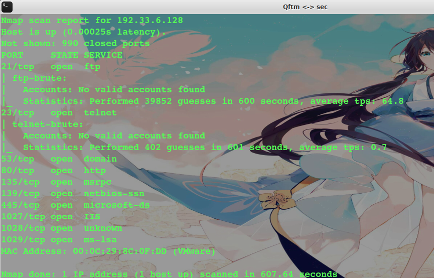

* 判断常见的漏洞并扫描端口

```
nmap 127.0.0.1 --script=auth,vuln

```

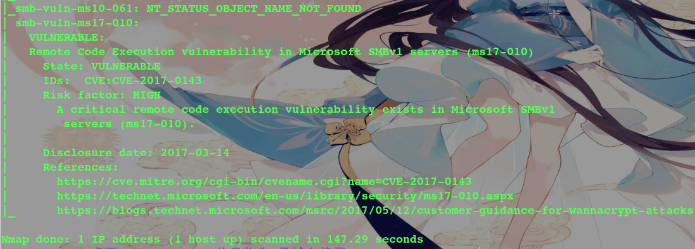

* 精确判断漏洞并扫描端口

```
nmap 127.0.0.1 --script=dns-zone-transfer,ftp-anon,ftp-proftpd-backdoor,ftp-vsftpd-backdoor,ftp-vuln-cve2010-4221,http-backup-finder,http-cisco-anyconnect,http-iis-short-name-brute,http-put,http-php-version,http-shellshock,http-robots.txt,http-svn-enum,http-webdav-scan,iis-buffer-overflow,iax2-version,memcached-info,mongodb-info,msrpc-enum,ms-sql-info,mysql-info,nrpe-enum,pptp-version,redis-info,rpcinfo,samba-vuln-cve-2012-1182,smb-vuln-ms08-067,smb-vuln-ms17-010,snmp-info,sshv1,xmpp-info,tftp-enum,teamspeak2-version

```

#### Masscan

项目地址：`https://github.com/robertdavidgraham/masscan`

Masscan主要是真对全网进行端口扫描

#### Zmap

项目地址：`https://github.com/zmap/zmap`

Zmap主要是真对全网进行端口扫描

#### 御剑高速TCP端口扫描工具

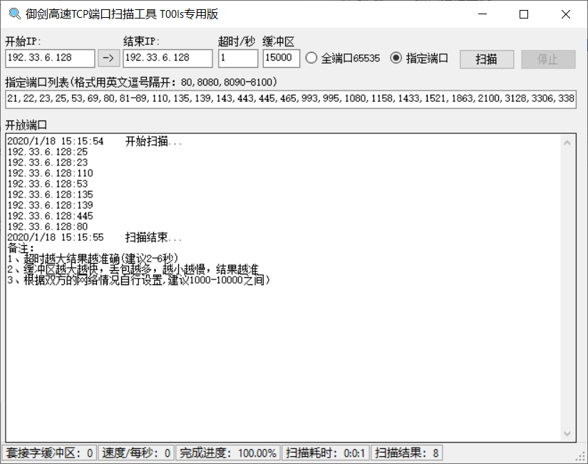

#### 御剑高速端口扫描工具


#### masnmapscan

项目地址：`https://github.com/hellogoldsnakeman/masnmapscan-V1.0`

masnmapscan整合了masscan和nmap两款扫描器，masscan扫描端口，nmap扫描端口对应服务，二者结合起来实现了又快又好地扫描。并且加入了针对目标资产有防火墙的应对措施。

### 网络空间引擎搜索

shodan、FOFA、zoomeye

FOFA为例

https://fofa.so/


### 浏览器插件

通过Google、FireFox等插件的使用，收集主机端口开放信息

#### Shodan


#### TCPIPUTILS


#### DNSlytics


# 指纹识别

在漏洞挖掘中，对目标服务器进行指纹识别是相当有必要的，因为只有识别出相应的Web容器或者CMS，才能查找与其相关的漏洞，然后才能进行相应的渗透操作。

CMS (Content Management System)又称整站系统或文章系统。常见的CMS有Dedecms (织梦)、Discuz、 PHPWEB、 PHPWind、PHPCMS、ECShop、 Dvbbs、 SiteWeaver、 ASPCMS、帝国、Z- Blog、WordPress等。


## 第三方平台

云悉 http://www.yunsee.cn/

TideFinger http://finger.tidesec.net/

BugScaner http://whatweb.bugscaner.com/look/

数字观星 https://fp.shuziguanxing.com/#/

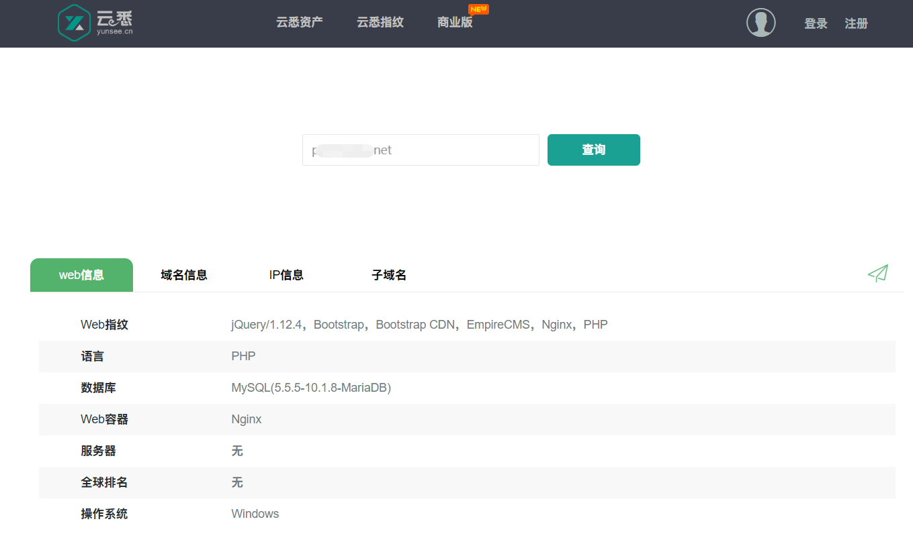

## 工具

常用指纹识别工具有：`御剑Web指纹识别`、`WhatWeb`、`Test404轻量CMS指纹识别+v2.1`、`椰树`等，可以快速识别一些主流CMS


Github项目

```
[CMSeeK](https://github.com/Tuhinshubhra/CMSeeK)

[CMSmap](https://github.com/Dionach/CMSmap)

[ACMSDiscovery](https://github.com/aedoo/ACMSDiscovery)

[TideFinger](https://github.com/TideSec/TideFinger)

[AngelSword](https://github.com/Lucifer1993/AngelSword)

```

## 浏览器插件

通过Google、FireFox等插件的使用，收集网站结构信息

### Wappalyzer

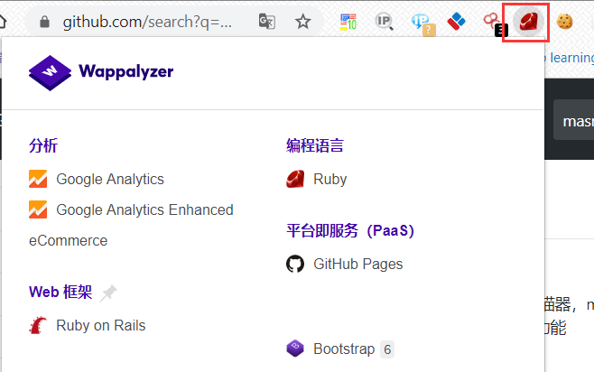

# 收集敏感信息

## WAF识别

识别网站使用的什么WAF，可以去找相应的绕过手段

### wafw00f

项目地址：https://github.com/EnableSecurity/wafw00f


## 源码泄露

### 常见源码泄露

```
/.bzr/
/CVS/Entries
/CVS/Root
/.DS_Store  MacOS自动生成
/.hg/
/.svn/ (/.svn/entries)
/.git/
/WEB-INF/src/
/WEB-INF/lib/
/WEB-INF/classes/
/WEB-INF/database.properties
/WEB-INF/web.xml

Robots.txt

```

上述源码泄露在Github上都可以找到相应的利用工具

### 源码泄露扫描工具

将常见源码泄露加入字典配合FUZZ、御剑等扫描器进行扫描收集

### 源码泄露利用工具

.git源码泄露：https://github.com/lijiejie/GitHack

.DS_Store泄露：https://github.com/lijiejie/ds_store_exp

.bzr、CVS、.svn、.hg源码泄露：https://github.com/kost/dvcs-ripper

## 备份文件泄露

### 网站备份文件泄露常见名称

```
backup
db
data
web
wwwroot
database
www
code
test
admin
user
sql

```

### 网站备份文件泄露常见后缀

```
.bak
.html
_index.html
.swp
.rar
.txt
.zip
.7z
.sql
.tar.gz
.tgz
.tar

```

### 网站备份文件泄露扫描工具

常见扫描工具有：Test404网站备份文件扫描器 v2.0、ihoneyBakFileScan等

ihoneyBakFileScan v0.2 多进程批量网站备份文件泄露扫描工具，根据域名自动生成相关扫描字典，自动记录扫描成功的备份地址到文件


## Google Hacking

### 常用GoogleHacking语法

1、intext：（仅针对Google有效）
把网页中的正文内容中的某个字符作为搜索的条件

2、intitle：
把网页标题中的某个字符作为搜索的条件

3、cache：
搜索搜索引擎里关于某些内容的缓存，可能会在过期内容中发现有价值的信息

4、filetype/ext：
指定一个格式类型的文件作为搜索对象

5、inurl：
搜索包含指定字符的URL

6、site：
在指定的(域名)站点搜索相关内容

### 其他GoogleHacking语法

1、引号 '' "
把关键字打上引号后，把引号部分作为整体来搜索

2、or
同时搜索两个或更多的关键字

3、link
搜索某个网站的链接 link:baidu.com即返回所有和baidu做了链接的URL

4、info
查找指定站点的一些基本信息

### GoogleHacking典型用法

- 管理后台地址

```
site:target.com intext:管理 | 后台 | 后台管理 | 登陆 | 登录 | 用户名 | 密码 | 系统 | 账号 | login | system
site:target.com inurl:login | inurl:admin | inurl:manage | inurl:manager | inurl:admin_login | inurl:system | inurl:backend
site:target.com intitle:管理 | 后台 | 后台管理 | 登陆 | 登录

```

- 上传类漏洞地址

```
site:target.com inurl:file
site:target.com inurl:upload

```

- 注入页面

```
site:target.com inurl:php?id=

```

- 编辑器页面

```
site:target.com inurl:ewebeditor

```

- 目录遍历漏洞

```
site:target.com intitle:index.of

```

- SQL错误

```
site:target.com intext:"sql syntax near" | intext:"syntax error has occurred" | intext:"incorrect syntax near" | intext:"unexpected end of SQL command" | intext:"Warning: mysql_connect()" | intext:”Warning: mysql_query()" | intext:”Warning: pg_connect()"

```

- phpinfo()

```
site:target.com ext:php intitle:phpinfo "published by the PHP Group"

```

- 配置文件泄露

```
site:target.com ext:.xml | .conf | .cnf | .reg | .inf | .rdp | .cfg | .txt | .ora | .ini

```

- 数据库文件泄露

```
site:target.com ext:.sql | .dbf | .mdb | .db

```

- 日志文件泄露

```
site:target.com ext:.log

```

- 备份和历史文件泄露

```
site:target.com ext:.bkf | .bkp | .old | .backup | .bak | .swp | .rar | .txt | .zip | .7z | .sql | .tar.gz | .tgz | .tar

```

- 公开文件泄露

```
site:target.com filetype:.doc | .docx | .xls | .xlsx | .ppt | .pptx | .odt | .pdf | .rtf | .sxw | .psw | .csv

```

- 邮箱信息 

```
site:target.com intext:@target.com
site:target.com 邮件
site:target.com email

```

- 社工信息

```
site:target.com intitle:账号 | 密码 | 工号 | 学号 | 身份证

```

## JS获取敏感接口

### JSFinder

JSFinder是一款用作快速在网站的js文件中提取URL，子域名的工具。

- 安装

```
pip3 install requests bs4
git clone https://github.com/Threezh1/JSFinder.git

```

- 使用

```
python3 JSFinder.py -u http://www.mi.com
python3 JSFinder.py -u http://www.mi.com -d

```

### LinkFinder

该工具通过网站中的JS文件来发现服务端、敏感信息、隐藏控制面板的URL链接等有用信息，可最大化地提高URL发现效率

- 安装

```
git clone https://github.com/GerbenJavado/LinkFinder.git
cd LinkFinder
python2 setup.py install

```

- 使用

在线JavaScript文件中查找端点的最基本用法，并将结果输出到results.html：

```
python linkfinder.py -i https://example.com/1.js -o results.html

```

CLI输出（不使用jsbeautifier，这使得它非常快）：

```
pyhon linkfinder.py -i https://example.com/1.js -o cli

```

分析整个域及其JS文件：

```
python linkfinder.py -i https://example.com -d

```

Burp输入（在目标中选择要保存的文件，右键单击，Save selected items将该文件作为输入）：

```
python linkfinder.py -i burpfile -b

```

枚举JavaScript文件的整个文件夹，同时查找以/ api /开头的终结点，并最终将结果保存到results.html：

```
python linkfinder.py -i 'Desktop/*.js' -r ^/api/ -o results.html

```

## 目录&后台扫描

常用工具-自己

```
7kbscan-WebPathBrute  https://github.com/7kbstorm/7kbscan-WebPathBrute
DirMap  https://github.com/H4ckForJob/dirmap
dirsearch https://github.com/maurosoria/dirsearch
Fuzz-gobuster https://github.com/OJ/gobuster
Test404轻量后台扫描器+v2.0
御剑

```

工具无论再多再好，没有一个好的字典一切都是空谈。强大字典是需要自己平时慢慢的积累。

## 越权查询

遍历uid获得身份信息等

## 代码托管

通过代码托管平台搜索敏感信息（内部邮箱账号密码、数据库账号密码等）

- github

GitHub是一个面向开源及私有软件项目的托管平台。

平台地址：https://github.com/

GitHub敏感信息泄露一直是企业信息泄露和知识产权泄露的重灾区，安全意识薄弱的同事经常会将公司的代码、各种服务的账户等极度敏感的信息『开源』到github中，github也是黑、白帽子、安全工程师的必争之地。

Github泄露扫描系统开发：https://sec.xiaomi.com/article/37

在GitHub中一般通过搜索网站域名、网站JS路径、网站备案、网站下的技术支持等进行敏感信息查询

- gitee

平台地址：https://gitee.com/

码云：开源中国出品的代码托管、协作开发平台。

- gitcafe

GitCafe一个基于代码托管服务打造的技术协作与分享平台

## Whois&备案查询

通过Whois和备案查询得到网站的注册人、手机号、邮箱等（对后续的密码生成和社工很有帮助）

## 公网网盘

公司员工可能把一些内部资料放在了公网网盘，然后被在线云网盘搜索的网站抓取了，我们就可以利用这个来对目标系统进行深入挖掘。

可以利用云网盘搜索工具搜集敏感文件，一般直接输入厂商名字进行搜索

### 凌风云搜索

地址：https://www.lingfengyun.com/


## 网站截图        

对目标网站页面进行截图，通过截图找到敏感页面

### webscreenshot

基于[`url-to-image`](https://github.com/kimmobrunfeldt/url-to-image/)的网站截图工具

- 安装

```
git clone https://github.com/maaaaz/webscreenshot.git

apt-get update && apt-get -y install phantomjs

phantomjs -v

Ubuntu 16 中安装 phantomjs 出现 QXcbConnection 问题
	export QT_QPA_PLATFORM=offscreen
	export QT_QPA_FONTDIR=/usr/share/fonts

```

- 使用

```
cd webscreenshot/

python2.7 webscreenshot.py -i url.txt

```

## 获取公开文件

### snitch

Snitch可以针对指定域自动执行信息收集过程。此工具可帮助收集可通过Web搜索引擎找到的指定信息。在渗透测试的早期阶段，它可能非常有用。

- 安装

```
git clone https://github.com/Smaash/snitch.git

```

- 使用

```
python2.7 snitch.py -C "site:whitehouse.gov filetype:pdf" -P 100

```

### Google Hacking

```
site: target.com filetype:doc|docx|xls|xlsx|ppt|pptx|zip|rar|sql

```

## 邮箱信息收集

### Infoga

Infoga可从不同的公共源网络（搜索引擎，pgp密钥服务器和shodan）收集电子邮件帐户信息（ip，主机名，国家/地区...）。是一个用法非常简单的工具，但是，对于渗透测试的早期阶段，或者只是为了了解自己公司在互联网上的可见性是非常有效的。

- 安装

```
git clone https://github.com/m4ll0k/Infoga.git /data/infoga
cd /data/infoga
pip3 install requests
python3 infoga.py

```

- 使用

```
python3 infoga.py --domain site.com --source all -v 3 | grep Email | cut -d ' ' -f 3 | uniq | sed -n '/-/!p'
python3 infoga.py --info emailtest@site.com
python3 infoga.py --info emailtest@site.com -b

```

### Google Hacking

```
site:target.com intext:@target.com
site:target.com 邮件
site:target.com email

```

# 历史漏洞&资产

很多时候去查看目标的历史漏洞和资产信息，往往能够得到很多有价值的信息。

乌云漏洞库：https://github.com/hanc00l/wooyun_public

Exploit-db：https://www.exploit-db.com/

Securityfocus：https://www.securityfocus.com/bid

Packetstorm：https://packetstormsecurity.org/

Cxsecurity：https://cxsecurity.com/exploit/

国家信息安全漏洞库：http://www.cnnvd.org.cn/

Seebug：https://www.seebug.org/

等。。。