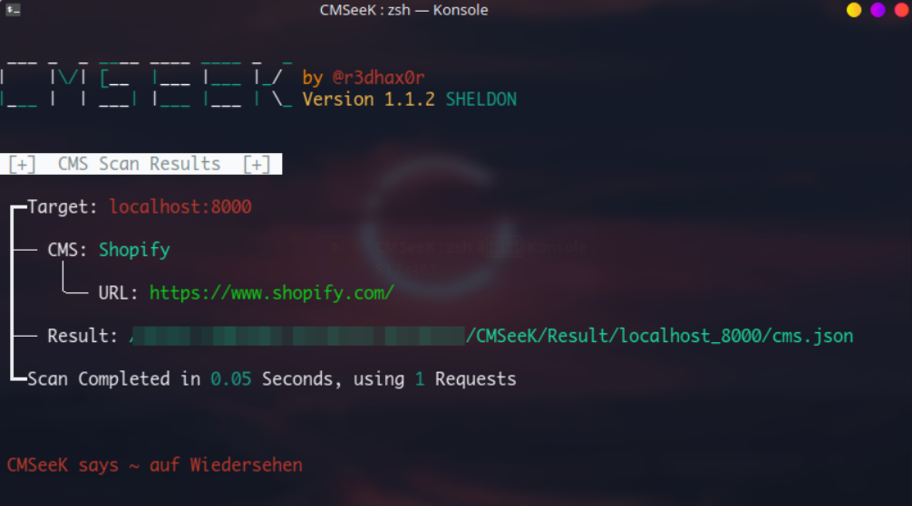

## 工具

常用指纹识别工具有：`御剑Web指纹识别`、`WhatWeb`、`Test404轻量CMS指纹识别+v2.1`、`椰树`等，可以快速识别一些主流CMS

Github项目

- [CMSeeK](https://github.com/Tuhinshubhra/CMSeeK)

- [CMSmap](https://github.com/Dionach/CMSmap)

- [ACMSDiscovery](https://github.com/aedoo/ACMSDiscovery)

- [TideFinger](https://github.com/TideSec/TideFinger)

- [AngelSword](https://github.com/Lucifer1993/AngelSword)

