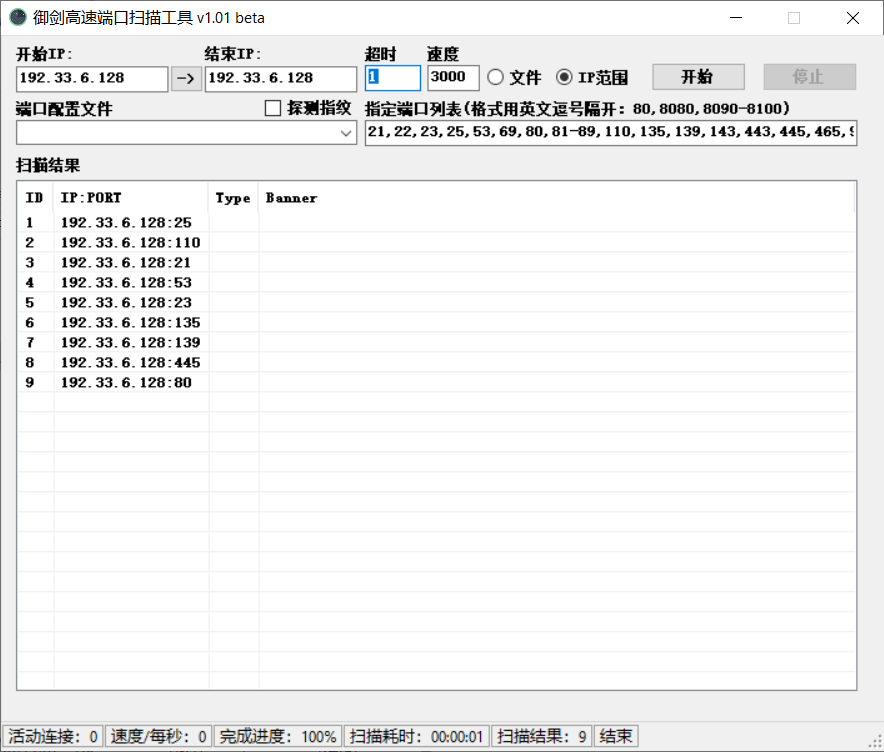

## 扫描工具

### 常用扫描工具

```
Nmap  

Masscan

masnmapscan

ZMap  

御剑高速TCP端口扫描工具

御剑高速端口扫描工具

IISPutScanner

IISPutScanner增强版-DotNetScan v1.1 Beta
```

### 常用扫描工具使用

#### Nmap

项目地址：`https://github.com/nmap/nmap`

* 扫描多个IP

```
扫描整个子网 nmap 192.168.6.1/24
		   nmap 192.168.1.1/16
		   nmap 192.168.1-30.1-254
		   nmap 192.168.1-254.6
扫描多个主机 namp 192.168.6.2 192.168.6.6
扫描一个小范围 nmap 192.168.6.2-10
扫描txt内的ip列表  nmap -iL text.txt
扫描除某个目标外   nmap 192.168.6.1/24 -exclude 192.168.6.25
```

* 绕过Firewalld扫描主机端口

通过不同的协议(TCP半连接、TCP全连接、ICMP、UDP等)的扫描绕过Firewalld的限制

```
nmap -sP 192.33.6.128
nmap -sT 192.33.6.128
nmap -sS 192.33.6.128
nmap -sU 192.33.6.128
nmap -sF 192.33.6.128
nmap -sX 192.33.6.128
nmap -sN 192.33.6.128
```

* 初步扫描端口信息

```
nmap -T4 -A -v -Pn 192.168.1.1/24 -p 21,22,23,25,80,81,82,83,88,110,143,443,445,512,513,514,1433,1521,2082,2083,2181,2601,2604,3128,3306,3389,3690,4848,5432,5900,5984,6379,7001,7002,8069,8080,8081,8086,8088,9200,9300,11211,10000,27017,27018,50000,50030,50070 -oN nmap_result.txt
```


* 扫描端口并且标记可以爆破的服务

```
nmap 127.0.0.1 --script=ftp-brute,imap-brute,smtp-brute,pop3-brute,mongodb-brute,redis-brute,ms-sql-brute,rlogin-brute,rsync-brute,mysql-brute,pgsql-brute,oracle-sid-brute,oracle-brute,rtsp-url-brute,snmp-brute,svn-brute,telnet-brute,vnc-brute,xmpp-brute
```


* 判断常见的漏洞并扫描端口

```
nmap 127.0.0.1 --script=auth,vuln
```


* 精确判断漏洞并扫描端口

```
nmap 127.0.0.1 --script=dns-zone-transfer,ftp-anon,ftp-proftpd-backdoor,ftp-vsftpd-backdoor,ftp-vuln-cve2010-4221,http-backup-finder,http-cisco-anyconnect,http-iis-short-name-brute,http-put,http-php-version,http-shellshock,http-robots.txt,http-svn-enum,http-webdav-scan,iis-buffer-overflow,iax2-version,memcached-info,mongodb-info,msrpc-enum,ms-sql-info,mysql-info,nrpe-enum,pptp-version,redis-info,rpcinfo,samba-vuln-cve-2012-1182,smb-vuln-ms08-067,smb-vuln-ms17-010,snmp-info,sshv1,xmpp-info,tftp-enum,teamspeak2-version
```

#### Masscan

项目地址：`https://github.com/robertdavidgraham/masscan`

Masscan主要是真对全网进行端口扫描

#### Masscan+Nmap

有些时候网站的入口点属于非常规端口，因此是必须要做全端口扫描，做全端口扫描的时候由于**namp**发包量大经常出现各种问题，如端口扫描不全、获得信息不准等等，为了解决上述问题，这里提供一个**masscan+nmap**结合的方式进行快速扫描。

原理：使用masscan做全端口开放检测，检测出来端口信息后，用nmap进行服务信息识别。

使用：终端输入以下命令执行即可

```
# masscan 192.33.6.145 -p1-65535  --rate 1000 -oL ports

# ports=$(cat ports | awk -F " " '{print $3}' | sort -n | tr '\n' ','  | sed 's/,$//' | sed 's/^,,//')

# nmap -sV -p $ports 192.33.6.145
```

#### masnmapscan

项目地址：`https://github.com/hellogoldsnakeman/masnmapscan-V1.0`

masnmapscan整合了masscan和nmap两款扫描器，masscan扫描端口，nmap扫描端口对应服务，二者结合起来实现了又快又好地扫描。并且加入了针对目标资产有防火墙的应对措施。

#### Zmap

项目地址：`https://github.com/zmap/zmap`

Zmap主要是真对全网进行端口扫描

#### 御剑高速TCP端口扫描工具


#### 御剑高速端口扫描工具

