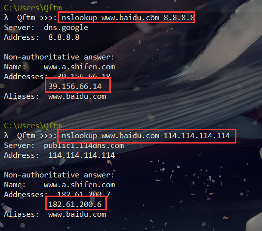
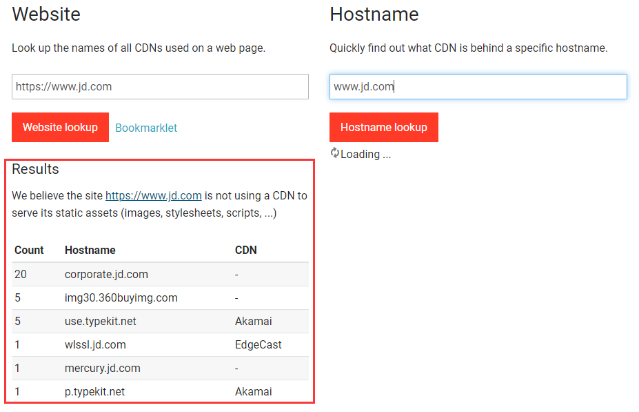

## 判断目标是否存在CDN

由于CDN需要代价，一般小企业很大几率不会存在CDN服务。

假如一些企业存在CDN服务，那该如何寻找其真实IP呢，往下看，常见几种手法

### Ping目标主域

通常通过ping目标主域，观察域名的解析情况，以此来判断其是否使用了CDN

对京东和阿里还有一家电器企业进行ping测试，观察域名的解析情况，可以看到京东和阿里都采用了自家CDN，而那个电器企业没有CDN服务

```
C:\Users\Qftm>ping www.jd.com

C:\Users\Qftm>ping www.alibaba.com

C:\Users\Qftm>ping www.dfle.com.cn
```


### Nslookup

#### 不同DNS域名解析

不同DNS域名解析情况对比，判断其是否使用了CDN

不同DNS解析结果若不一样，很有可能存在CDN服务

```
C:\Users\Qftm>nslookup www.dfle.com.cn 8.8.8.8

C:\Users\Qftm>nslookup www.dfle.com.cn 114.114.114.114
```


```
λ  Qftm >>>: nslookup www.baidu.com 8.8.8.8

λ  Qftm >>>: nslookup www.baidu.com 114.114.114.114
```



#### nslookup默认解析

若解析结果有多个，很有可能存在CDN，相反，若解析结果有一个，可能不存在CDN(不能肯定)


### 全国Ping

利用全国多地区的ping服务器操作，然后对比每个地区ping出的IP结果，查看这些IP是否一致， 如果都是一样的，极有可能不存在CDN。如果IP大多不太一样或者规律性很强，可以尝试查询这些IP的归属地，判断是否存在CDN。

在线网址

- [Ping检测-站长工具](http://ping.chinaz.com/)

- [17CE](https://www.17ce.com/)

- [ipip (支持国内、国外)](https://tools.ipip.net/newping.php)

#### 站长工具

测试目标：`www.jd.com`


#### 17CE

测试目标：`www.baidu.com`


#### IPIP


### 工具查询

这里工具只能作为辅助，有一定误报的概率，只能作为参考

#### Cdnplanet

- [cdnplanet](https://www.cdnplanet.com/tools/cdnfinder/) （查询可能比较慢）

