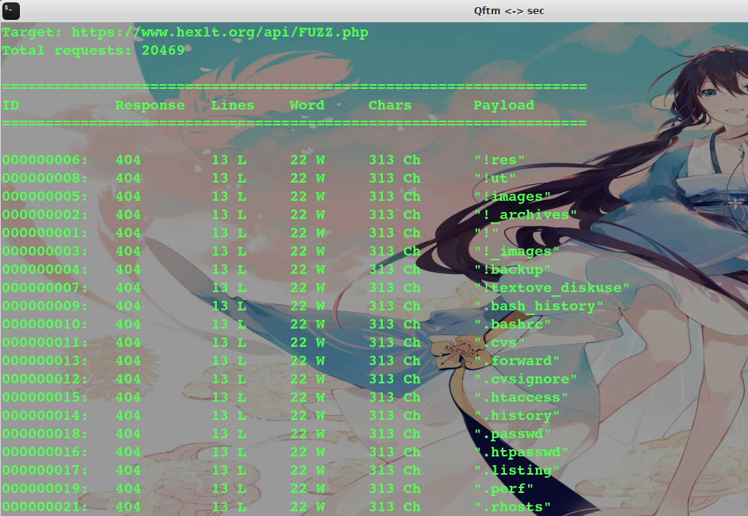

## 目录&后台扫描

常用工具-自己

```
7kbscan-WebPathBrute  https://github.com/7kbstorm/7kbscan-WebPathBrute
DirMap        https://github.com/H4ckForJob/dirmap
dirsearch     https://github.com/maurosoria/dirsearch
Fuzz-gobuster https://github.com/OJ/gobuster
Fuzz-dirbuster OWASP kali自带
Fuzz-wfuzz    https://github.com/xmendez/wfuzz
Test404轻量后台扫描器+v2.0
御剑
```

个人比较喜欢使用Fuzz大法，不管是目录扫描、后台扫描、Web漏洞模糊测试都是非常灵活的。这几款fuzz工具都比较好用

```
基于Go开发：gobuster
基于Java开发：dirbuster
基于Python开发：wfuzz
```

- dirbuster


- wfuzz



工具无论再多再好，没有一个好的字典一切都是空谈。强大字典是需要自己平时慢慢的积累。