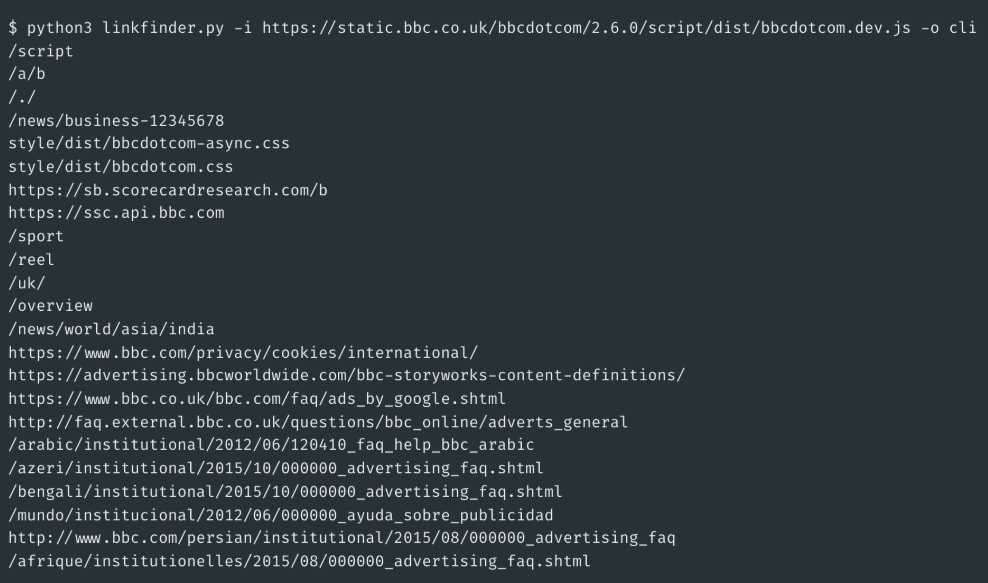

## JS获取敏感接口

### JSFinder

JSFinder是一款用作快速在网站的js文件中提取URL，子域名的工具。

- 安装

```
pip3 install requests bs4
git clone https://github.com/Threezh1/JSFinder.git
```

- 使用

```
python3 JSFinder.py -u http://www.mi.com
python3 JSFinder.py -u http://www.mi.com -d
```


### LinkFinder

该工具通过网站中的JS文件来发现服务端、敏感信息、隐藏控制面板的URL链接等有用信息，可最大化地提高URL发现效率

- 安装

```
git clone https://github.com/GerbenJavado/LinkFinder.git
cd LinkFinder
python2 setup.py install
```

- 使用

在线JavaScript文件中查找端点的最基本用法，并将结果输出到results.html：

```
python linkfinder.py -i https://example.com/1.js -o results.html
```

CLI输出（不使用jsbeautifier，这使得它非常快）：

```
pyhon linkfinder.py -i https://example.com/1.js -o cli
```

分析整个域及其JS文件：

```
python linkfinder.py -i https://example.com -d
```

Burp输入（在目标中选择要保存的文件，右键单击，Save selected items将该文件作为输入）：

```
python linkfinder.py -i burpfile -b
```

枚举JavaScript文件的整个文件夹，同时查找以/ api /开头的终结点，并最终将结果保存到results.html：

```
python linkfinder.py -i 'Desktop/*.js' -r ^/api/ -o results.html
```

