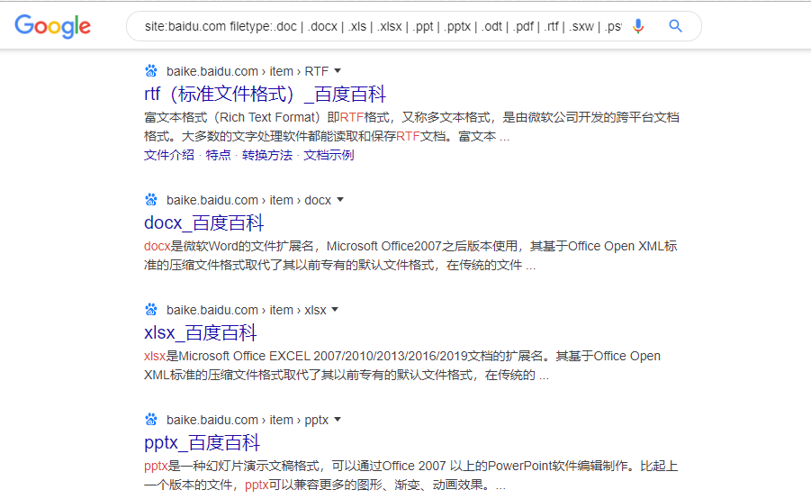

## 获取公开文件

### snitch

Snitch可以针对指定域自动执行信息收集过程。此工具可帮助收集可通过Web搜索引擎找到的指定信息。在渗透测试的早期阶段，它可能非常有用。

- 安装

```
git clone https://github.com/Smaash/snitch.git
```

- 使用

```
python2.7 snitch.py -C "site:whitehouse.gov filetype:pdf" -P 100
```


### Google Hacking

```
site:target.com filetype:.doc | .docx | .xls | .xlsx | .ppt | .pptx | .odt | .pdf | .rtf | .sxw | .psw | .csv
```

